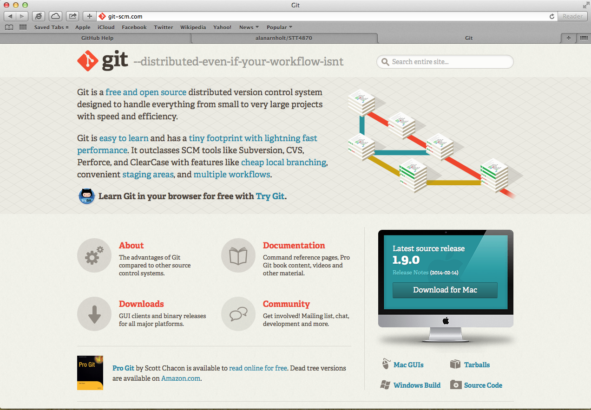
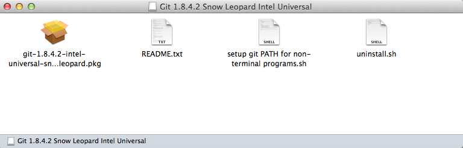
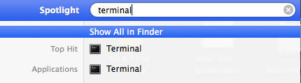
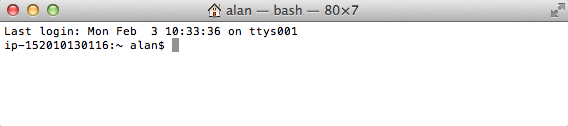
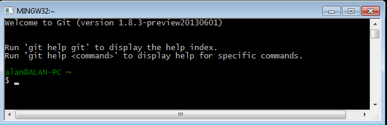
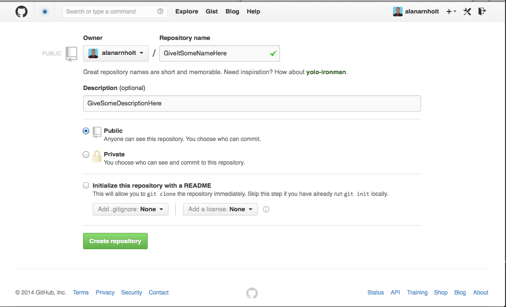
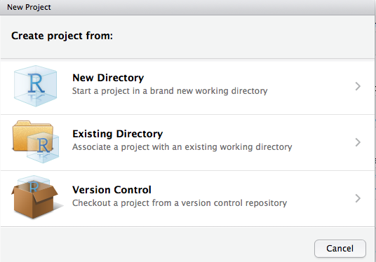
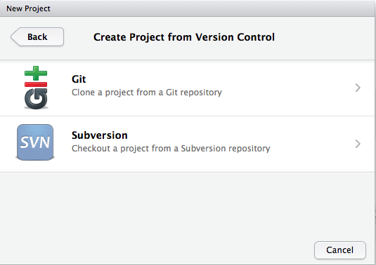

## Git - Notes
### Alan T. Arnholt

```{r Systime, echo = FALSE, comment = NA, engine = "R"}
DT <- format(Sys.time(), "%A, %B %d, %Y - %X")
```

```{r label = SETUP, echo = FALSE}
opts_chunk$set(comment = NA, engine = "bash", fig.align="center", fig.height = 4, fig.width = 4, dev ="png", cache = FALSE)
```

Last compiled `r DT`.

What is version control, and why should you use it?  Version control is a way to track files over time.  By using version control, you will be able to retrace your steps to
a previous working (read un-hosed) version of your files.  You may be using a form of version control now with files named like the following:

* YourNameCVJanuary2014.docx
* YourNameCVMarch2014.docx
* chapter1-012412.tex
* chapter2-032312.tex

You may even back up your files for major projects in many different places.  When working on book projects in the past, I would back up my files on three different 
local machines and two servers.  That works fine until you start using the files from one location and forget that you updated the files on another machine, and you are using an old version of a file for new updates.  Now you have new material on old files and may have overwritten several weeks of work.  Expletives follow, and you set to "un-hosing" your work which may take longer than it took to write the original document.  Is this a real scenario?  Yes, and the problem only grows exponentially when working with colleagues who all have access to the same files on a major project.

I now use version control, specifically Git, for virtually all of my work.  Notes for classes I am teaching have their own repositories (repos), and students and other interested parties can clone my repos.  If you have material that you would like to remain private, you can set up private repositories.  Thankfully, I have not lost a single file I could not recover since switching my work to Git.  

One last thought before we talk about actually installing and using Git.  You may be thinking, I have never lost a file because I back up all of my files on an external hardrive.  Great; however, suppose you lose your machine and external hard drive due to a catastrophic event.  Now what?  Well, if you are not using some form of version control, your work is most likely gone for good. If you were using version control, you just need to set up a new machine and continue your work where you left off.


### Downloading Git

Download and install the lastest version of [Git.](http://git-scm.com/downloads)



### Mac Users
Install the downloaded file by clicking on the downloaded `*.dmg` file then clicking on the `*.pkg` file. 



If you get a message indicating the file is from an untrusted source, ignore the warning and click on the **Open** button.  If there is no option to **Open**, hold down the CTRL key, select `*.pkg` file, then choose *Open With -> Installer (default)*.

### Windows users

Once the download is complete, right click on the downloaded file to install it as an 
administrator.  Use the default options at each step of the installation if you are 
unsure of what you are doing.  When the installation arrives at the screen adjusting your 
PATH environment, click in the circle to the left of 
**Run Git from the Windows Command Prompt**.
You may need to add the path to where the `bash.exe` resides manually.  Run the 
following at the `R` prompt to make sure `R` knows where to find `bash.`  Note that the 
path below will be dependent on the operating system you are using.

```{r label= BashCheck, engine="R", cache = TRUE}
Sys.which("bash")
```
If the output does not specify the path to `bash,` the path to `bash` is not properly configured.

To interact with Git, find the program named Git Bash.  Git Bash is the command line environment Windows uses to interact with Git.  Git Bash should be located in the Git directory within your Start Menu, provided you performed a default installation.


## Initial Setup

If you have never used Git before, you need to do some setup first.  Run the following
commands so that Git knows your name and email.  The commands are all issued in the
Terminal (Mac) or at the command prompt of Git Bash (Windows).  The Terminal 
application is usually found in `/applications/Utilities.` A quick way to open a 
**terminal** window is by clicking on the magnifying glass icon and typing *terminal* in spotlight.  



### Mac Users
By clicking on the Terminal application, a Terminal window will open.



### Windows Users
To open Git Bash, click on the *Windows icon -> Git -> Git Bash*.  The program is most likely located in the Git directory within your Start Menu (or the directory into which Git was installed).


By clicking on the Git Bash icon, a window similar to the one below will open.



### Run these commands

```{r label = GITsetup, eval = FALSE}
git config --global user.name "Your Name"
git config --global user.email "your_email@whatever.com"
git config --global color.ui true
```

If you do not want to type your username and password every time you work with a remote server, you will need to install the credential helper.  See the article [Set Up Git](https://help.github.com/articles/set-up-git#platform-all) for additional details on setting up the credential helper.

To confirm your username and email, type `git config --list` at the $ prompt.

```{r label=verify}
git config --list  # shows your configuration
```

From the `credential.helper` line of the previous output, one can see the 
`credential.helper` is being used.  Now that Git is set up on your computer, we provide instructions for setting up a remote repository on GitHub.

### What is GitHub?

"GitHub is a web-based hosting service for software development projects that use 
the Git revision control system. GitHub offers both paid plans for private 
repositories and free accounts for open source projects. The site was launched 
in 2008 by Tom Preston-Werner, Chris Wanstrath, and PJ Hyett."
[http://en.wikipedia.org/wiki/GitHub](http://en.wikipedia.org/wiki/GitHub)

Qualified faculty members can request free private accounts to use with their classes.
To request a discount, which actually pays the whole price for 10 private repositories 
for qualified faculty, click on the request a discount at 
[https://education.github.com](https://education.github.com).  A step-by-step guide 
for setting up your GitHub organization for classroom use can be found at 
[https://education.github.com/guide](https://education.github.com/guide).   Free private repositories for anyone can be created at 
[https://bitbucket.org](https://bitbucket.org).  Bitbucket, like GitHub, is a web 
based hosting service that uses the Git revision control system.

## Creating a GitHub Account

Point your browser to [https://github.com](https://github.com);
type a username in the `Pick a username` box (please use `firstlast`, for example my 
username is `alanarnholt`); enter your email (use your school email) in the 
`Your email` box; type in your password in the `Create a password` box. Then, 
click the `Sign up for GitHub` box, and you will have a GitHub account.  You should 
use the same name you used when you set up your `user.name` and `user.email` on your 
local machine.


### Creating a GitHub Repository

In order to push your local work to a remote repository, you will first need to create
the remote repository. Log in to your GitHub account; click the `New repository` button;
then, give your repository a name and optionally a description.  When you finish, click 
the `Create repository` button, and your GitHub repository will be created.  You should click in the box `Initialize this repository with a README` if you want GitHub to create a markdown README file.  



This document is stored in the repository [https://github.com/alanarnholt/STT4870](https://github.com/alanarnholt/STT4870) in the folder [https://github.com/alanarnholt/STT4870/Git](https://github.com/alanarnholt/STT4870/Git).


## Local Repositories

Once you have your remote repository created on GitHub, you will need to create a local
copy of the remote repository on your computer so that you can make changes locally. 
It is possible to set up a local repository using the command line or using GUI (drop, drag, etc.) commands.  We start by first looking at typed commands.  Then, we examine a 
GUI to Git.   

Open either a Terminal (Mac) or Git Bash (Windows).  Create a directory on your computer where you will store your copy of the GitHub 
(remote) repository.

```{r label = MKDIR, eval = FALSE}
mkdir ~/TestProject
```

The tilde (~) refers to your home directory.  In other words, `~/TestProject`
will create a directory called `TestProject` in your home directory.  Navigate 
to the new directory by typing

```{r label = CDdir, eval = FALSE}
cd ~/TestProject
```

Once you have a local directory with files you
would like to place under version control, use the `git init` command from your working
directory to track your files. 


```{r label = INIT, eval = FALSE}
git init
```

Now, we are ready to point our local repository to the remote repository on GitHub by typing

```{r label = REMOTE, eval = FALSE}
git remote add origin https://github.com/your-user-name/TestProject.git
```

The last line needs some explanation!  The `add` creates the *new remote*; the `origin` is the name for the remote; and the url is the path to the remote.


If you are working with a new repository and do not have an existing version on 
your computer, you need to "clone" the GitHub repo to your computer.  From the working directory of your local machine, type:

```{r label = CLONE, eval = FALSE}
git clone https://github.com/your-user-name/TestProject.git
```

I keep my repositories in a folder called *git_repositories* that
is a subfolder of my *USERNAME* directory.   If you clone a remote repository 
to your machine, you will not need to initialize your directory.

### Forking  a Repo
Another common way to clone a repo is by first "forking" someone else's repo.   Forking a repo creates a remote (GitHub) copy of the forked repo.   To work on the forked repo, you first must clone the remote fork to your local  machine.  When a repository is cloned, it has a default remote called `origin` that points to your fork on GitHub, not the original repository from which it was forked.  This means that updates the orignal repo owner makes will not automatically be added to your forked repo.

To keep track of this repo, you need to add another remote named `upstream.`  This can be done by typing

```{r label = UPSTREAM, eval = FALSE}
git remote add upstream https://github.com/alanarnholt/STT4870.git
```

To pull in changes not present in your local repository without modifying your
files, type

```{r label = Fetch, eval = FALSE}
git fetch upstream  
```

When you fetch the upstream repository,  the upstream branches are stored
in your local repository in a local branch named `upstream/master.`  Next, you need to merge the changes into your local branch to bring your local branch in sync with the upstream branch without losing any local changes.  Make sure you are on the master branch by typing `git checkout master.`  Then, enter `git merge upstream/master.`  Once your local branch is in sync with the upstream remote, you will want to push your local changes back to your forked repo on GitHub by typing `git push.` 

Another approach is to use

```{r label = PULL2, eval = FALSE}
git pull upstream master
```

What is the difference?


## GUI approach with RStudio

One way to clone this repo using `RStudio` is  to click on File -> New Project 



Click Version Control, and a new window such as the one below will appear where you will select Git.



In the next window that appears, which is shown below, enter the URL for the repository you are cloning.  Enter a project name, and specify where you want the project to reside on your computer.  When you are finished, click the `Create Project` button; and you will have cloned a remote repository.


To check the current status of your repository type:
```{r label = STATUS}
git status
```
The `git status` shows us what files are not staged for a commit.  Before files can be
committed, they must be added to the staging area.  Files are added to the stating area
with the command `git add file_name.`  To add all files in the working directory, one
can use `git add .` (The command includes the period.)  Next, all files are added to the staging area, and a snapshot is 
taken of the commit with the message "staging all files."
```{r label = ADD}
git add .
git commit  -m "staging all files"
```

Check the status after the last commit.
```{r label = STATUS2}
git status
```
Push changes to the remote repository. 
```{r label = PUSH}
git push
```
See if there is anything left to do.
```{r label = STATUS3}
git status
```
Show the last three commits with
```{r label = LOG}
git log  -3
```

That was ugly. Let us try some formatting.

```{r label = LOGP}
git log --pretty=oneline -3
```

The previous output was too brief to suit me.  Let us try some further formatting.

```{r label = LOGP2}
git log --pretty=format:"%h %ad- %s [%an]" -3
```

Maybe even some statistics?

```{r label = LOGP3}
git log --pretty=format:"%h %ad- %s [%an]" -3 --stat
```

Now, just to show how cool this is, we will mix in a little `R.`

```{r label = Rgraph, engine = 'R', fig.width = 8}
library(ggplot2)
ggplot(data = CO2, aes(x = Type, y = uptake, fill = Type)) + 
  geom_boxplot() +
  facet_grid(Treatment~.) +
  theme_bw()
```

I love graphs!  The following graph created with `ggplot2` uses Greek letters in
the facet panels.  

```{r label=ggplot2Graphs, engine = "R", fig.width = 8, fig.height = 8, echo = FALSE}
x <- seq(0, 7, length = 500)
y1 <- dweibull(x, 1, 1)
y2 <- dweibull(x, 1, 2)
y3 <- dweibull(x, 1, 3)
y4 <- dweibull(x, 2, 1)
y5 <- dweibull(x, 2, 2)
y6 <- dweibull(x, 2, 3)
y7 <- dweibull(x, 3, 1)
y8 <- dweibull(x, 3, 2)
y9 <- dweibull(x, 3, 3)
DF <- data.frame(fx = c(y1, y2, y3, y4, y5, y6, y7, y8, y9))
DF$a[1:1500] = "alpha == 1"
DF$a[1501:3000] = "alpha == 2"
DF$a[3001:4500] = "alpha == 3"
DF$b[1:500] = "beta == 1"
DF$b[501:1000] = "beta == 2"
DF$b[1001:1500] = "beta == 3"
DF$b[1501:2000] = "beta == 1"
DF$b[2001:2500] = "beta == 2"
DF$b[2501:3000] = "beta == 3"
DF$b[3001:3500] = "beta == 1"
DF$b[3501:4000] = "beta == 2"
DF$b[4001:4500] = "beta == 3"
DF$x = x
#
previous_theme <- theme_set(theme_bw()) # set black and white theme
ggplot(data = DF, aes(x = x, y = fx)) + geom_area(fill = "skyblue3") + 
  facet_grid(b~a, labeller = label_parsed) + 
  labs(x = "x", y = "f(x)",labeller = label_parsed) + 
  theme(panel.grid.major = element_blank(), panel.grid.minor = element_blank()) 
theme_set(previous_theme) # Restore original theme 
```

### So you want to collaborate?

At this point, you have forked a repo and would like to contribute to
someone's project.  A great place to start is by reading [https://help.github.com/articles/using-pull-requests](https://help.github.com/articles/using-pull-requests).
