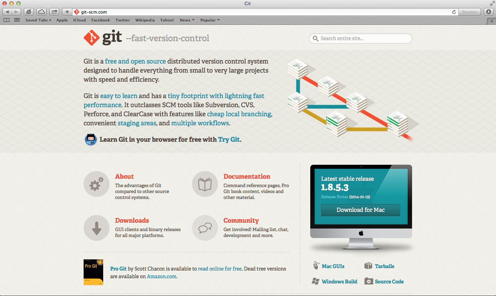
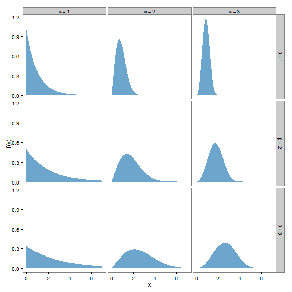

## Git - Notes
### Alan T. Arnholt


Last compiled Tuesday, February 04, 2014 - 8:34:28 PM.

Download and install the lastest version of [Git.](http://git-scm.com/downloads)



## Mac Users
Install the downloaded file by clicking on the downloaded `*.dmg` file then clicking on the `*.pkg` file. 


If you get a message indicating the file is from an untrusted source, ignore the warning and click on the **Open** button.  If there is no option to **Open**, hold down the CTRL key, select `*.pkg` file, then choose *Open With -> Installer (default)*.

## Windows users

Once the download is complete, right click on the downloaded file to install it as an 
administrator.  Use the default options at each step of the installation if you are unsure 
what you are doing.  When the installation arrives at the screen adjusting your PATH 
environment, click in the circle to the left of **Run Git from the Windows Command Prompt**.


## Initial Setup

If you have never used git before, you need to do some setup first.  Run the following
commands so that git knows your name and email.  The commands are all issued in the
Terminal (Mac) or at the command prompt of Git Bash (Windows).  The Terminal 
application is usually found in `/applications/Utilities`. A quick way to open a 
**terminal** window is by clicking on the magnifying glass icon and typing *terminal* in spotlight.  


By clicking on the Terminal application, a Terminal window will open.


To open Git Bash, click on the *Windows icon -> Git -> Git Bash*.  The program is most likely located in the Git directory within your Start Menu (or the directory into which Git was installed).


By clicking on the Git Bash icon, a window similar to the one below will open.


## Run these commands


```bash
git config --global user.name "Your Name"
git config --global user.email "your_email@whatever.com"
git config --global color.ui true
```


If you do not want to type your username and password every time you work with a remote server, you will to install the credential helper.  See the article [Set Up Git](https://help.github.com/articles/set-up-git#platform-all) for additional details on setting up the credential helper.

To confirm your username and email, type `git config --list` at the $ prompt.


```bash
git config --list
```

```
core.symlinks=false
core.autocrlf=true
color.diff=auto
color.status=auto
color.branch=auto
color.interactive=true
pack.packsizelimit=2g
help.format=html
http.sslcainfo=/bin/curl-ca-bundle.crt
sendemail.smtpserver=/bin/msmtp.exe
diff.astextplain.textconv=astextplain
rebase.autosquash=true
user.name=Alan Arnholt
user.email=arnholtat@appstate.edu
core.repositoryformatversion=0
core.filemode=false
core.bare=false
core.logallrefupdates=true
core.symlinks=false
core.ignorecase=true
core.hidedotfiles=dotGitOnly
remote.origin.fetch=+refs/heads/*:refs/remotes/origin/*
remote.origin.url=https://github.com/alanarnholt/STT4870.git
branch.master.remote=origin
branch.master.merge=refs/heads/master
```


From the third line of the previous output, one can see the `credential.helper` is 
being used (when I run this with OSX, but not from home.) 

### Creating a GitHub Account

Point your browser to [https://github.com](https://github.com),
type a username in the `Pick a username` box (please use `firstlast`, for example my username is `alanarnholt`), enter your email (use your school email) in the `Your email` box, type in your password in the `Create a password` box. Then, click the `Sign up for GitHub` box and you will have a GitHub account.


### Creating a GitHub Repository

In order to push your local work to a remote repository, you will first need to create
the remote repository. Log in to your GitHub account, click the `New repository` button,
then give your repository a name and optionally a description.  When you finish, click 
the `Create repository` button, and your GitHub repository will be created.  


This document is stored in the repository [https://github.com/alanarnholt/STT4870](https://github.com/alanarnholt/STT4870) in the folder [https://github.com/alanarnholt/STT4870/Git](https://github.com/alanarnholt/STT4870/Git). 

## Local Repositories

It is possible to set up a local repository using GUI (drop, drag, etc.) commands or to
use the command line.  I keep my repositories in a folder called *git_repositories* that
is a subfolder of my *USERNAME* directory.  Once you have a local folder with files you
would like to place under version control, use the `git init` command from your working
directory to track your files.  If you clone a remote repository to your machine, you 
will not need to initialize your directory.  One way to clone this repo using `RStudio` is 
to click on File -> New Project 


Click Version Control and a new window such as the one below will appear where you will select Git.


In the next window that appears, which is shown below, enter the URL for the repository you are cloning.  Enter a project name and specify where you want the project to reside on your computer.  When you are finished, click the `Create Project` button and you will have cloned a remote repository.


To check the current status of your repository type:

```bash
git status
```

```
On branch master
Your branch is ahead of 'origin/master' by 1 commit.
  (use "git push" to publish your local commits)

Changes not staged for commit:
  (use "git add <file>..." to update what will be committed)
  (use "git checkout -- <file>..." to discard changes in working directory)

	modified:   GitOne.html
	modified:   GitOne.md

no changes added to commit (use "git add" and/or "git commit -a")
```

The `git status` shows us what files are not staged for a commit.  Before files can be
committed, they must be added to the staging area.  Files are added to the stating area
with the command `git add file_name`.  To add all files in the working directory, one
can use `git add .`  Next, all files are added to the staging area, and a snapshot is 
taken of the commit with the message "staging all files."

```bash
git add .
git commit  -m "staging all files"
```

```
[master fffc0a5] staging all files
 2 files changed, 179 insertions(+), 287 deletions(-)
```


Check the status after the last commit.

```bash
git status
```

```
On branch master
Your branch is ahead of 'origin/master' by 2 commits.
  (use "git push" to publish your local commits)

nothing to commit, working directory clean
```

Push changes to the remote repository. 

```bash
git push
```

See if there is anything left to do.

```bash
git status
```

```
On branch master
Your branch is ahead of 'origin/master' by 2 commits.
  (use "git push" to publish your local commits)

nothing to commit, working directory clean
```

Show the last three commits with

```bash
git log  -3
```

```
commit fffc0a52f633f32d32b8b4b2aece08a6d43382a3
Author: Alan Arnholt <arnholtat@appstate.edu>
Date:   Tue Feb 4 20:34:28 2014 -0500

    staging all files

commit c8a1e5299f04a1314ed9b6c7762f2d33f6033bce
Author: Alan Arnholt <arnholtat@appstate.edu>
Date:   Tue Feb 4 20:33:21 2014 -0500

    staging all files

commit 59d1bd3e72f7edca47d35b1820416359d197e857
Author: Alan Arnholt <arnholtat@appstate.edu>
Date:   Tue Feb 4 20:30:42 2014 -0500

    note no spaces in path between "paths"...because no the machine finds "bash"!
```


That was ugly. Let us try some formatting.


```bash
git log --pretty=oneline -3
```

```
fffc0a52f633f32d32b8b4b2aece08a6d43382a3 staging all files
c8a1e5299f04a1314ed9b6c7762f2d33f6033bce staging all files
59d1bd3e72f7edca47d35b1820416359d197e857 note no spaces in path between "paths"...because no the machine finds "bash"!
```


The previous output was to brief to suit me.  Let us try some further formatting.


```bash
git log --pretty=format:"%h %ad- %s [%an]" -3
```

```
fffc0a5 Tue Feb 4 20:34:28 2014 -0500- staging all files [Alan Arnholt]
c8a1e52 Tue Feb 4 20:33:21 2014 -0500- staging all files [Alan Arnholt]
59d1bd3 Tue Feb 4 20:30:42 2014 -0500- note no spaces in path between "paths"...because no the machine finds "bash"! [Alan Arnholt]
```


Maybe even some statistics?


```bash
git log --pretty=format:"%h %ad- %s [%an]" -3 --stat
```

```
fffc0a5 Tue Feb 4 20:34:28 2014 -0500- staging all files [Alan Arnholt]
 Git/GitOne.html | 236 ++++++++++++++++++++++----------------------------------
 Git/GitOne.md   | 230 +++++++++++++++++++++---------------------------------
 2 files changed, 179 insertions(+), 287 deletions(-)

c8a1e52 Tue Feb 4 20:33:21 2014 -0500- staging all files [Alan Arnholt]
 Git/GitOne.Rmd  | 4 ++--
 Git/GitOne.html | 4 ++--
 Git/GitOne.md   | 4 ++--
 3 files changed, 6 insertions(+), 6 deletions(-)

59d1bd3 Tue Feb 4 20:30:42 2014 -0500- note no spaces in path between "paths"...because no the machine finds "bash"! [Alan Arnholt]
 Git/GitOne.html                                    | 248 +++++++++++++++++++-
 Git/GitOne.md                                      | 257 ++++++++++++++++++++-
 .../ADD_37d613968d89bfc0fc573bd5f4d62239.RData     | Bin 0 -> 355 bytes
 Git/cache/ADD_37d613968d89bfc0fc573bd5f4d62239.rdb |   0
 Git/cache/ADD_37d613968d89bfc0fc573bd5f4d62239.rdx | Bin 0 -> 113 bytes
 .../ADD_540999b9c1daaa4c31ccd2c535b3e499.RData     | Bin 149 -> 0 bytes
 Git/cache/ADD_540999b9c1daaa4c31ccd2c535b3e499.rdb |   0
 Git/cache/ADD_540999b9c1daaa4c31ccd2c535b3e499.rdx | Bin 113 -> 0 bytes
 ...GITsetup_b0c970510ef94c7a948b007d4995e2c2.RData | Bin 196 -> 0 bytes
 .../GITsetup_b0c970510ef94c7a948b007d4995e2c2.rdb  |   0
 .../GITsetup_b0c970510ef94c7a948b007d4995e2c2.rdx  | Bin 113 -> 0 bytes
 .../LOGP2_0930b13cd33e07882e62208756650246.RData   | Bin 157 -> 0 bytes
 .../LOGP2_0930b13cd33e07882e62208756650246.rdb     |   0
 .../LOGP2_0930b13cd33e07882e62208756650246.rdx     | Bin 113 -> 0 bytes
 .../LOGP2_faf1a7fcf18137324c7c98647d730ea6.RData   | Bin 0 -> 333 bytes
 .../LOGP2_faf1a7fcf18137324c7c98647d730ea6.rdb     |   0
 .../LOGP2_faf1a7fcf18137324c7c98647d730ea6.rdx     | Bin 0 -> 113 bytes
 .../LOGP3_659c34076beb625769e9c295d213ece7.RData   | Bin 164 -> 0 bytes
 .../LOGP3_659c34076beb625769e9c295d213ece7.rdb     |   0
 .../LOGP3_659c34076beb625769e9c295d213ece7.rdx     | Bin 113 -> 0 bytes
 .../LOGP3_ad807c34590b81f628e6cb6032102919.RData   | Bin 0 -> 974 bytes
 .../LOGP3_ad807c34590b81f628e6cb6032102919.rdb     |   0
 .../LOGP3_ad807c34590b81f628e6cb6032102919.rdx     | Bin 0 -> 113 bytes
 .../LOGP_85b7cbcb21a72630e78bd3b750ea156f.RData    | Bin 0 -> 329 bytes
 .../LOGP_85b7cbcb21a72630e78bd3b750ea156f.rdb      |   0
 .../LOGP_85b7cbcb21a72630e78bd3b750ea156f.rdx      | Bin 0 -> 113 bytes
 .../LOGP_cd45074def45e6f242a15e5d861bc924.RData    | Bin 138 -> 0 bytes
 .../LOGP_cd45074def45e6f242a15e5d861bc924.rdb      |   0
 .../LOGP_cd45074def45e6f242a15e5d861bc924.rdx      | Bin 113 -> 0 bytes
 .../LOG_087011b0f8f69f16e2c2e5605086c615.RData     | Bin 0 -> 408 bytes
 Git/cache/LOG_087011b0f8f69f16e2c2e5605086c615.rdb |   0
 Git/cache/LOG_087011b0f8f69f16e2c2e5605086c615.rdx | Bin 0 -> 113 bytes
 .../LOG_5e9c536809b42ad3cb23e4fa1a84bd45.RData     | Bin 121 -> 0 bytes
 Git/cache/LOG_5e9c536809b42ad3cb23e4fa1a84bd45.rdb |   0
 Git/cache/LOG_5e9c536809b42ad3cb23e4fa1a84bd45.rdx | Bin 113 -> 0 bytes
 .../PUSH_4a4f909daa6525f7416b0e0df208f325.RData    | Bin 0 -> 121 bytes
 .../PUSH_4a4f909daa6525f7416b0e0df208f325.rdb      |   0
 .../PUSH_4a4f909daa6525f7416b0e0df208f325.rdx      | Bin 0 -> 113 bytes
 .../PUSH_ccaa07cffd798cbbde965296b32e8be8.RData    | Bin 119 -> 0 bytes
 .../PUSH_ccaa07cffd798cbbde965296b32e8be8.rdb      |   0
 .../PUSH_ccaa07cffd798cbbde965296b32e8be8.rdx      | Bin 113 -> 0 bytes
 .../STATUS2_5e0c7941154f2f6f6d64705c7f833e80.RData | Bin 124 -> 0 bytes
 .../STATUS2_5e0c7941154f2f6f6d64705c7f833e80.rdb   |   0
 .../STATUS2_5e0c7941154f2f6f6d64705c7f833e80.rdx   | Bin 113 -> 0 bytes
 .../STATUS2_8ac7feaeff926fc5b62fe3cb6b50f859.RData | Bin 0 -> 580 bytes
 .../STATUS2_8ac7feaeff926fc5b62fe3cb6b50f859.rdb   |   0
 .../STATUS2_8ac7feaeff926fc5b62fe3cb6b50f859.rdx   | Bin 0 -> 113 bytes
 .../STATUS3_12105d35cf1bc9dd32a9a4e2704fe895.RData | Bin 0 -> 729 bytes
 .../STATUS3_12105d35cf1bc9dd32a9a4e2704fe895.rdb   |   0
 .../STATUS3_12105d35cf1bc9dd32a9a4e2704fe895.rdx   | Bin 0 -> 113 bytes
 .../STATUS3_d5fbd0803a466f8b6e8890bfd4fc3513.RData | Bin 124 -> 0 bytes
 .../STATUS3_d5fbd0803a466f8b6e8890bfd4fc3513.rdb   |   0
 .../STATUS3_d5fbd0803a466f8b6e8890bfd4fc3513.rdx   | Bin 113 -> 0 bytes
 .../STATUS_c69090ea171fdc61120b83150e1ec346.RData  | Bin 123 -> 0 bytes
 .../STATUS_c69090ea171fdc61120b83150e1ec346.rdb    |   0
 .../STATUS_c69090ea171fdc61120b83150e1ec346.rdx    | Bin 113 -> 0 bytes
 .../verify_f81c0bc60aa03951091d1db4b41e9fca.RData  | Bin 130 -> 0 bytes
 .../verify_f81c0bc60aa03951091d1db4b41e9fca.rdb    |   0
 .../verify_f81c0bc60aa03951091d1db4b41e9fca.rdx    | Bin 113 -> 0 bytes
 59 files changed, 481 insertions(+), 24 deletions(-)
```


Now, just to show how cool this is, we will mix in a little `R`.


```r
library(ggplot2)
ggplot(data = CO2, aes(x = Type, y = uptake, fill = Type)) + geom_boxplot() + 
    facet_grid(Treatment ~ .) + theme_bw()
```


I love graphs!  The following graph created with `ggplot2` uses Greek letters in
the facet panels.  




### So you want to collaborate?

At this point, you have forked a repo and would like to contribute to
someone's project.  A great place to start is by reading [https://help.github.com/articles/using-pull-requests](https://help.github.com/articles/using-pull-requests).
