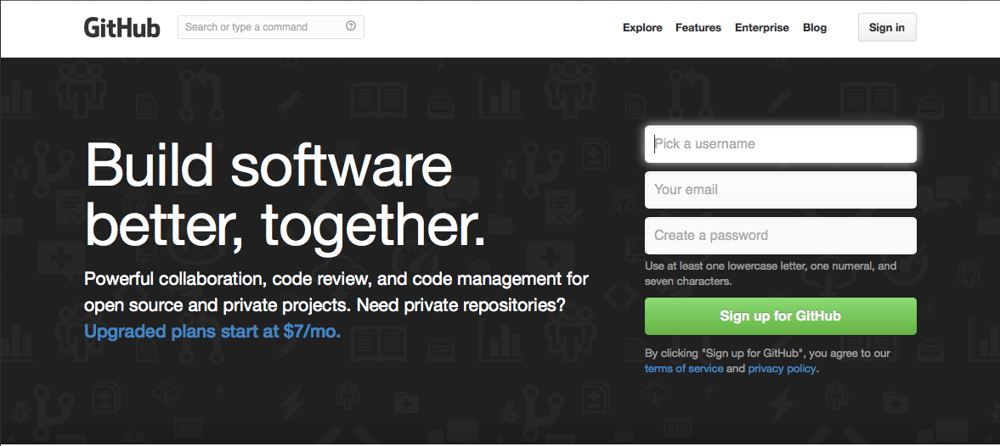
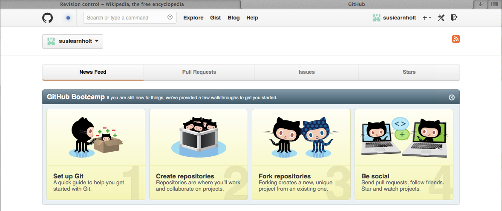
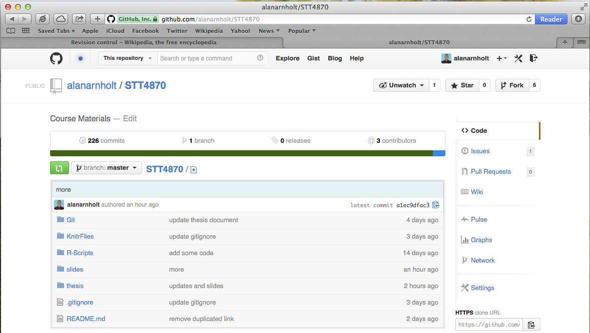
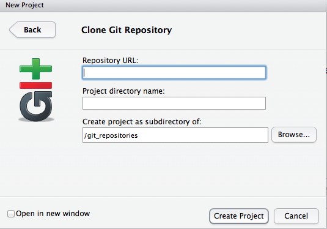

Version Control (Git)
========================================================
author: Alan Arnholt
date: 3/21/14

What is version control?
========================================================
``Revision control, also known as version control and source control (and an aspect of software configuration management), is the management of changes to documents, computer programs, large web sites, and other collections of information. Changes are usually identified by a number or letter code, termed the "revision number", "revision level", or simply "revision". For example, an initial set of files is "revision 1". When the first change is made, the resulting set is "revision 2", and so on. Each revision is associated with a timestamp and the person making the change. Revisions can be compared, restored, and with some types of files, merged.''  
[http://en.wikipedia.org/wiki/Revision_control](http://en.wikipedia.org/wiki/Revision_control)

Why should you use version control?
======================================================

* YourNameCVFeb2014.docx
* YourNameCVMar2004.docx
* chapter1-021309.tex
* chapter1-032311.tex
* chapter1-031409.tex
 

Explain...


Goals for Today
========================================================
incremental: true  
* Install Git
* Create a GitHub account
* Fork a GitHub repository
* Configure Git settings
* Use `push` and `pull`


Install Git
========================================================
If your machine does not have a recent version of Git,
point your browser to [http://gitscm.com](http://gitscm.com) and install the latest binary for your operating system.


Create a GitHub account
========================================================
incremental: true

* Use Mozilla in Walker 209B (Safari is very dated and does not work well with GitHub)
* Point your browser to [https://github.com](https://github.com)
* Click the green Sign up for GitHub button



Create a GitHub account (continued)
========================================================
incremental: true

* For a username, I suggest `firstlast`
* Use your school email so you can request private repositories later
* Click the green `Create an account` button
* Log in to your account



Fork a GitHub repository
=================================================




Git Configurations
========================================================


```bash
git config --global user.name "Your Name"
git config --global user.email "Joe@appstate.edu"
```


My Git Configurations
========================================================


```bash
git config --list  # shows your configuration
```

```
<<<<<<< HEAD
user.name=Alan Arnholt
user.email=arnholtat@appstate.edu
push.default=simple
credential.helper=osxkeychain
filter.media.clean=git-media-clean %f
filter.media.smudge=git-media-smudge %f
color.ui=true
=======
credential.helper=osxkeychain
>>>>>>> f4dcceb9d6b4099d524a1c603ff0767f615c1311
core.repositoryformatversion=0
core.filemode=true
core.bare=false
core.logallrefupdates=true
core.ignorecase=true
remote.origin.fetch=+refs/heads/*:refs/remotes/origin/*
remote.origin.url=https://github.com/alanarnholt/STT4870.git
branch.master.remote=origin
branch.master.merge=refs/heads/master
user.name=Alan Arnholt
user.email=arnholtat@appstate.edu
```


Clone a repo to your local machine
=======================================================
incremental: true

* Command line (make sure you are in your working directory)

```bash
git clone https://github.com/alanarnholt/STT4870.git
```

* GUI RStudio  `File -> New Project ... -> Version Control -> Git`




Remotes
=======================================================

```bash
git remote -v
```

```
origin	https://github.com/alanarnholt/STT4870.git (fetch)
origin	https://github.com/alanarnholt/STT4870.git (push)
```


Thesis
=======================================================
* Go to [https://github.com/alanarnholt/STT4870/tree/master/thesis/](https://github.com/alanarnholt/STT4870/tree/master/thesis/) and open the main.pdf file for more details.
* Go over `origin` and `upstream` with Git Example 2.5
* Use `git pull upstream master`.
* Show Figure 2.8

