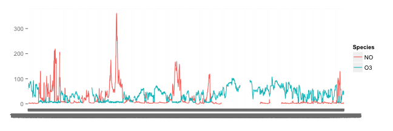

Reading Data
========================================================
author: Alan Arnholt
date: 02/09/14

Using source_data()
========================================================

The function `source_data()` from the `repmis` package can read data from both secure (https://) and unsecure (http://) sites.

* Example 1 (reading from an unsecure web site) - could also use `read.table()`
* Example 2 (reading from a Dropbox Public secure web site)  
* Example 3 (reading from a Github secure web site)
* Example 4 (reading from a Dropbox non-public secure web site)

Example 1
========================================================
Read the file stored at [http://www1.appstate.edu/~arnholta/Data/NCBirths2004.csv](http://www1.appstate.edu/~arnholta/Data/NCBirths2004.csv) using `read.table()` and `source_data()`


```r
site <- paste("http://www1.appstate.edu/", "~arnholta/Data/NCBirths2004.csv", sep = "")
NCbirthsRD <- read.table(file = site, header = TRUE, sep = ",")
NCbirthsRD[1:2, 1:5]
```

```
  ID MothersAge Tobacco Alcohol Gender
1  1      30-34      No      No   Male
2  2      30-34      No      No   Male
```


Note: run in console to see SHA-1 hash

Example 1 continued
========================================================


```r
NCbirthsSD <- repmis::source_data(url=site)
NCbirthsSD[1:9, 1:5]
```

```
  ID MothersAge Tobacco Alcohol Gender
1  1      30-34      No      No   Male
2  2      30-34      No      No   Male
3  3      35-39      No      No Female
4  4      20-24      No      No Female
5  5      25-29      No      No   Male
6  6      35-39      No      No Female
7  7      20-24      No      No Female
8  8      20-24      No      No   Male
9  9      20-24      No      No   Male
```


Example 2
================================================================
Read the file stored at [https://dl.dropboxusercontent.com/u/134274843/data/HSWRESTLER.csv](https://dl.dropboxusercontent.com/u/134274843/data/HSWRESTLER.csv) using `source_data()`.  Note this file is stored in a *Public* folder of my Dropbox account.


```r
site <- paste("https://dl.dropboxusercontent", ".com/u/134274843/data/", "HSWRESTLER.csv", sep = "")
wrest <- repmis::source_data(url = site)
wrest[1:2, 1:7]
```

```
  age    ht    wt abs triceps subscap hwfat
1  18 65.75 133.6   8       6    10.5 10.71
2  15 65.50 129.0  10       8     9.0  8.53
```


Example 3
==========================================================================
Read the file stored at [https://raw2.github.com/alanarnholt/Data/master/HSWRESTLER.csv](https://raw2.github.com/alanarnholt/Data/master/HSWRESTLER.csv) using `source_data()`.


```r
site <- paste("https://raw2.github.com/", "alanarnholt/Data/master/", "HSWRESTLER.csv", sep = "")
wrestGH <- repmis::source_data(url = site)
wrest[1:3, 1:7]
```

```
  age    ht    wt abs triceps subscap hwfat
1  18 65.75 133.6   8       6    10.5 10.71
2  15 65.50 129.0  10       8     9.0  8.53
3  17 64.00 120.8   6       6     8.0  6.78
```


Using source_DropboxData() - Example 4
==========================================================================
Read the non-public Dropbpox file stored at [https://www.dropbox.com/s/36r9k12fdyzc9zp/HSWRESTLER.csv](https://www.dropbox.com/s/36r9k12fdyzc9zp/HSWRESTLER.csv)  using `source_DropboxData()`.


```r
wrestNPDP <- repmis::source_DropboxData("HSWRESTLER.CSV", "36r9k12fdyzc9zp")
wrestNPDP[1:3, 1:7]
```

```
  age    ht    wt abs triceps subscap hwfat
1  18 65.75 133.6   8       6    10.5 10.71
2  15 65.50 129.0  10       8     9.0  8.53
3  17 64.00 120.8   6       6     8.0  6.78
```

 
Using source_data() - Example 5
==========================================================================
Consider a *.csv file downloaded from [http://www.londonair.org.uk/](http://www.londonair.org.uk/) and stored in a public folder on Dropbox [https://dl.dropboxusercontent.com/u/134274843/data/LaqnData.csv](https://dl.dropboxusercontent.com/u/134274843/data/LaqnData.csv).  Read the data in to `R`.


```r
site <- paste("https://dl.dropboxusercontent", ".com/u/134274843/data/LaqnData.csv", sep = "")
AD <- repmis::source_data(site)
AD[1:2, 1:5]
```

```
  Site Species ReadingDateTime Value  Units
1  HG4      NO   1/1/2013 0:00    NA ug m-3
2  HG4      NO   1/1/2013 0:15     2 ug m-3
```


Example 5 - continued
============================================================================


```r
library(ggplot2)
ggplot(data = AD, aes(x = ReadingDateTime, y = Value, group = Species, color = Species)) + geom_line() + labs(x = "", y = "")
```


Example 6 - Same data from Github
==============================================================================
Read the same data store on Github ([https://raw2.github.com/alanarnholt/SEMINAR/master/Alan/summaries/data/LaqnData.csv](https://raw2.github.com/alanarnholt/SEMINAR/master/Alan/summaries/data/LaqnData.csv).)


```r
site <- paste("https://raw2.github.com/", "alanarnholt/SEMINAR/master/Alan/", "summaries/data/LaqnData.csv", sep ="")
AD2 <- repmis::source_data(site)
ggplot(data = AD2, aes(x = ReadingDateTime, y = Value, group = Species, color = Species)) + geom_line() + labs(x = "", y = "")
```



